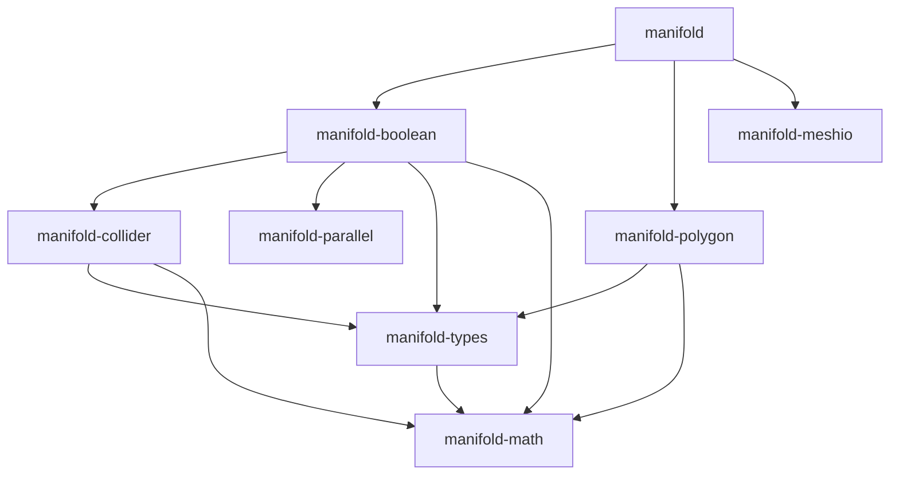

# Comprehensive Manifold C++ to Rust Migration Plan

## Executive Summary

This document provides a **strict 1:1 migration plan** for porting the Manifold geometry library from C++ to Rust. The plan adheres to the absolute principle that **only the C++ reference code is authoritative** — no alternative algorithms, external implementations, or "improvements" are permitted.

---

## 1. Guiding Principles

### 1.1 Absolute Requirements

1. **Strict Algorithm Parity**: Every function, branch, loop, and predicate must match the C++ reference exactly.
2. **No External Algorithms**: All implementations must be derived solely from `submodules/manifold/`. Using external algorithms (even from well-known geometry libraries) is **prohibited**.
3. **Numerical Determinism**: Floating-point operations must produce identical results. Critical functions like `Interpolate`, `Intersect`, and `Shadows` must be ported character-by-character.
4. **Parallelism Parity**: Thresholds (`kSeqThreshold = 1e4`) and execution policies must match exactly.
5. **Test Coverage**: Every C++ test must have a Rust equivalent, plus additional coverage for edge cases.

### 1.2 Safety vs. Parity Trade-offs

- **Algorithmic parity is absolute** — even if it requires `unsafe` Rust code.
- Memory safety is a secondary goal achieved through Rust idioms where possible.
- If C++ uses patterns requiring `unsafe`, document and encapsulate carefully.

---

## 2. Source Code Reference Analysis

### 2.1 Core Source Files (submodules/manifold/src/)

| File | Lines | Purpose | Complexity | Priority |
|------|-------|---------|------------|----------|
| `boolean3.cpp` | 553 | Core Boolean operations (Union, Difference, Intersection) | Critical | P0 |
| `boolean_result.cpp` | ~600 | Boolean output assembly, mesh construction | Critical | P0 |
| `impl.cpp` | ~1200 | Manifold implementation (B-Rep operations) | Critical | P0 |
| `impl.h` | 405 | Impl struct definition, MeshRelation | Critical | P0 |
| `csg_tree.cpp` | ~800 | CSG tree lazy evaluation | High | P1 |
| `csg_tree.h` | ~150 | CsgNode definitions | High | P1 |
| `collider.h` | 371 | BVH spatial acceleration | Critical | P0 |
| `constructors.cpp` | 525 | Primitive shapes (Cube, Sphere, Cylinder, etc.) | Medium | P2 |
| `quickhull.cpp` | ~600 | Convex hull algorithm | Medium | P2 |
| `quickhull.h` | 289 | QuickHull data structures | Medium | P2 |
| `polygon.cpp` | ~800 | 2D polygon triangulation | High | P1 |
| `tree2d.cpp` | ~300 | 2D spatial tree | High | P1 |
| `tree2d.h` | ~100 | 2D tree structures | High | P1 |
| `smoothing.cpp` | ~600 | Mesh smoothing operations | Medium | P3 |
| `subdivision.cpp` | ~500 | Mesh subdivision | Medium | P3 |
| `properties.cpp` | ~400 | Property interpolation | Medium | P3 |
| `sort.cpp` | ~200 | Morton code sorting | High | P1 |
| `edge_op.cpp` | ~400 | Edge operations | High | P1 |
| `face_op.cpp` | ~300 | Face operations | High | P1 |
| `sdf.cpp` | ~300 | Signed Distance Field | Medium | P3 |
| `manifold.cpp` | ~600 | Public API | High | P1 |

### 2.2 Header-Only Critical Files

| File | Purpose |
|------|---------|
| `parallel.h` | TBB parallel primitives (1162 lines) — **must port every function** |
| `shared.h` | Halfedge, TriRef, Barycentric, utility functions |
| `disjoint_sets.h` | Thread-safe Union-Find with atomics |
| `hashtable.h` | Concurrent hash table |
| `vec.h` | Custom Vec implementation |
| `utils.h` | General utilities |
| `iters.h` | Iterator utilities |
| `svd.h` | SVD decomposition |
| `tri_dist.h` | Triangle distance calculations |
| `mesh_fixes.h` | Mesh repair utilities |

### 2.3 Public Headers (include/manifold/)

| File | Purpose |
|------|---------|
| `common.h` | Core types (vec2, vec3, mat3x4, Box, etc.) |
| `manifold.h` | Public Manifold API |
| `polygon.h` | Polygon triangulation API |
| `cross_section.h` | 2D cross-section operations (Clipper2) |
| `meshIO.h` | Mesh I/O operations |
| `linalg.h` | Linear algebra (we use glam) |

---

## 3. Crate Architecture

```
manifold-rust/
├── Cargo.toml (workspace)
├── crates/
│   ├── manifold-types/      # Core types
│   ├── manifold-math/       # Math utilities
│   ├── manifold-parallel/   # Parallel primitives
│   ├── manifold-collider/   # BVH implementation
│   ├── manifold-polygon/    # 2D triangulation
│   ├── manifold-boolean/    # Boolean kernel
│   ├── manifold-meshio/     # I/O operations
│   └── manifold/            # Public API
└── tests/
    ├── integration/         # Integration tests
    └── golden/              # Golden test data
```

### 3.1 Crate Dependencies



---

## 4. Detailed Module Mapping

### 4.1 manifold-types

**Source Files:** `shared.h`, `common.h` (partially)

```rust
// Core structures - exact match to C++
pub struct Halfedge {
    pub start_vert: i32,
    pub end_vert: i32,
    pub paired_halfedge: i32,
    pub prop_vert: i32,
}

impl Halfedge {
    pub fn is_forward(&self) -> bool {
        self.start_vert < self.end_vert
    }
}

pub struct Barycentric {
    pub tri: i32,
    pub uvw: DVec4,
}

pub struct TriRef {
    pub mesh_id: i32,
    pub original_id: i32,
    pub face_id: i32,
    pub coplanar_id: i32,
}

pub struct TmpEdge {
    pub first: i32,
    pub second: i32,
    pub halfedge_idx: i32,
}

pub struct Smoothness {
    pub halfedge: usize,
    pub smoothness: f64,
}
```

**Also includes:**
- `MeshGL` / `MeshGL64` generic mesh types
- `MeshRelation` struct
- Error enum matching C++ `Error`

### 4.2 manifold-math

**Source Files:** `common.h`, `utils.h`, `svd.h`, `tri_dist.h`

```rust
// Constants - exact match
pub const K_PI: f64 = 3.14159265358979323846264338327950288;
pub const K_TWO_PI: f64 = 6.28318530717958647692528676655900576;
pub const K_HALF_PI: f64 = 1.57079632679489661923132169163975144;
pub const K_PRECISION: f64 = 1e-12;  // From common.h

// Functions - exact implementation
pub fn radians(a: f64) -> f64 { a * K_PI / 180.0 }
pub fn degrees(a: f64) -> f64 { a * 180.0 / K_PI }

pub fn smoothstep(edge0: f64, edge1: f64, a: f64) -> f64 {
    let x = ((a - edge0) / (edge1 - edge0)).clamp(0.0, 1.0);
    x * x * (3.0 - 2.0 * x)
}

// sind/cosd - exact match to C++ for multiples of 90°
pub fn sind(x: f64) -> f64 {
    if !x.is_finite() { return x.sin(); }
    if x < 0.0 { return -sind(-x); }
    let (x_rem, quo) = remquo(x.abs(), 90.0);
    match quo % 4 {
        0 => radians(x_rem).sin(),
        1 => radians(x_rem).cos(),
        2 => -radians(x_rem).sin(),
        3 => -radians(x_rem).cos(),
        _ => 0.0,
    }
}

pub fn cosd(x: f64) -> f64 { sind(x + 90.0) }
```

**Box struct:**
```rust
pub struct Box {
    pub min: DVec3,
    pub max: DVec3,
}

impl Box {
    pub fn new(p1: DVec3, p2: DVec3) -> Self {
        Self {
            min: p1.min(p2),
            max: p1.max(p2),
        }
    }
    
    pub fn size(&self) -> DVec3 { self.max - self.min }
    pub fn center(&self) -> DVec3 { 0.5 * (self.max + self.min) }
    pub fn scale(&self) -> f64 {
        let abs_max = self.min.abs().max(self.max.abs());
        abs_max.x.max(abs_max.y.max(abs_max.z))
    }
    pub fn contains(&self, p: DVec3) -> bool {
        p.cmpge(self.min).all() && self.max.cmpge(p).all()
    }
    pub fn does_overlap(&self, other: &Box) -> bool {
        self.min.x <= other.max.x && self.max.x >= other.min.x &&
        self.min.y <= other.max.y && self.max.y >= other.min.y &&
        self.min.z <= other.max.z && self.max.z >= other.min.z
    }
}
```

### 4.3 manifold-parallel

**Source File:** `parallel.h` (ALL 1162 lines)

This is **critical** — every parallel primitive must be ported exactly.

```rust
pub const K_SEQ_THRESHOLD: usize = 10_000;

#[derive(Clone, Copy, PartialEq)]
pub enum ExecutionPolicy {
    Par,
    Seq,
}

pub fn auto_policy(size: usize, threshold: usize) -> ExecutionPolicy {
    if size <= threshold {
        ExecutionPolicy::Seq
    } else {
        ExecutionPolicy::Par
    }
}

// All parallel operations from parallel.h:
pub fn for_each<I, F>(policy: ExecutionPolicy, iter: I, f: F)
where
    I: IntoIterator + IntoParallelIterator,
    F: Fn(I::Item) + Sync + Send;

pub fn for_each_n<F>(policy: ExecutionPolicy, start: usize, n: usize, f: F)
where
    F: Fn(usize) + Sync + Send;

pub fn transform<I, O, F>(policy: ExecutionPolicy, input: I, output: &mut [O], f: F);

pub fn reduce<T, I, F, R>(policy: ExecutionPolicy, iter: I, identity: T, f: F, reduce: R) -> T;

pub fn exclusive_scan<T, F>(policy: ExecutionPolicy, input: &[T], output: &mut [T], init: T, f: F);

pub fn inclusive_scan<T, F>(policy: ExecutionPolicy, input: &[T], output: &mut [T], f: F);

pub fn copy_if<T, P>(policy: ExecutionPolicy, input: &[T], output: &mut Vec<T>, pred: P) -> usize;

pub fn stable_sort<T, F>(policy: ExecutionPolicy, data: &mut [T], cmp: F);

pub fn stable_sort_by_key<T, K, F>(policy: ExecutionPolicy, data: &mut [T], key: F);

// Merge sort implementation from parallel.h (lines 74-110)
fn merge_rec<T, F>(src: &[T], dest: &mut [T], p1: usize, r1: usize, 
                   p2: usize, r2: usize, p3: usize, cmp: &F);
fn merge_sort_rec<T, F>(src: &mut [T], dest: &mut [T], begin: usize, end: usize, cmp: &F);
```

### 4.4 manifold-collider

**Source File:** `collider.h` (371 lines)

```rust
// Constants from collider.h
const K_INITIAL_LENGTH: i32 = 128;
const K_LENGTH_MULTIPLE: i32 = 4;
const K_SEQUENTIAL_THRESHOLD: i32 = 512;
const K_ROOT: i32 = 1;

// Node type helpers - exact match
pub fn is_leaf(node: i32) -> bool { node % 2 == 0 }
pub fn is_internal(node: i32) -> bool { node % 2 == 1 }
pub fn node_to_internal(node: i32) -> i32 { (node - 1) / 2 }
pub fn internal_to_node(internal: i32) -> i32 { internal * 2 + 1 }
pub fn node_to_leaf(node: i32) -> i32 { node / 2 }
pub fn leaf_to_node(leaf: i32) -> i32 { leaf * 2 }

pub struct Collider {
    node_parent: Vec<i32>,
    internal_children: Vec<(i32, i32)>,
    leaf_morton: Vec<u32>,
    node_bbox: Vec<Box>,
    // ... other fields
}

impl Collider {
    pub fn new(bboxes: &[Box]) -> Self;
    pub fn collisions<F, R>(&self, query_fn: F, query_size: usize, recorder: &mut R);
}

// CreateRadixTree struct - exact implementation
struct CreateRadixTree {
    node_parent: &mut [i32],
    internal_children: &mut [(i32, i32)],
    leaf_morton: &[u32],
}

impl CreateRadixTree {
    fn prefix_length(&self, a: u32, b: u32) -> i32 {
        (a ^ b).leading_zeros() as i32
    }
    
    fn range_end(&self, i: i32) -> i32;
    fn find_split(&self, first: i32, last: i32) -> i32;
}
```

### 4.5 manifold-boolean

**Source Files:** `boolean3.cpp`, `boolean3.h`, `boolean_result.cpp`, `impl.cpp`, `impl.h`, `csg_tree.cpp`

#### 4.5.1 Critical Boolean Kernel Functions (boolean3.cpp)

The Boolean kernel in `boolean3.cpp` (553 lines) contains these critical functions that **MUST** be ported exactly:

| Function | Lines | Purpose | Template Params |
|----------|-------|---------|-----------------|
| `withSign` | 38 | Sign helper | - |
| `Interpolate` | 40-53 | X-axis interpolation | - |
| `Intersect` | 55-72 | Line segment intersection | - |
| `Shadows` | 74-76 | Symbolic perturbation predicate | - |
| `Shadow01` | 78-122 | Vertex-edge shadow test | `<expandP, forward>` |
| `Kernel11` | 124-180 | Edge-edge intersection | `<expandP>` |
| `Kernel02` | 182-248 | Vertex-face intersection | `<expandP, forward>` |
| `Kernel12` | 250-320 | Edge-face intersection | `<expandP, forward>` |
| `Kernel12Recorder` | 322-380 | Records edge-face intersections | `<expandP, forward>` |
| `Intersect12_` | 382-430 | Edge-triangle intersection driver | `<expandP, forward>` |
| `Intersect12` | 432-438 | Template dispatcher | `<forward>` |
| `Winding03_` | 440-520 | Winding number calculation | `<expandP, forward>` |
| `Winding03` | 522-528 | Template dispatcher | `<forward>` |
| `Boolean3::Boolean3` | 530-553 | Constructor | - |

```rust
// From boolean3.cpp lines 37-74 - EXACT PORT REQUIRED

/// The only floating-point operations in the Boolean kernel
#[inline]
fn with_sign(pos: bool, v: f64) -> f64 {
    if pos { v } else { -v }
}

/// Critical interpolation function - must match C++ exactly
#[inline]
pub fn interpolate(a_l: DVec3, a_r: DVec3, x: f64) -> DVec2 {
    let dx_l = x - a_l.x;
    let dx_r = x - a_r.x;
    debug_assert!(dx_l * dx_r <= 0.0, "Boolean manifold error: not in domain");
    
    let use_l = dx_l.abs() < dx_r.abs();
    let d_lr = a_r - a_l;
    let lambda = if use_l { dx_l } else { dx_r } / d_lr.x;
    
    if !lambda.is_finite() || !d_lr.y.is_finite() || !d_lr.z.is_finite() {
        return DVec2::new(a_l.y, a_l.z);
    }
    
    DVec2::new(
        lambda * d_lr.y + if use_l { a_l.y } else { a_r.y },
        lambda * d_lr.z + if use_l { a_l.z } else { a_r.z },
    )
}

/// Critical intersection function - must match C++ exactly
pub fn intersect(a_l: DVec3, a_r: DVec3, b_l: DVec3, b_r: DVec3) -> DVec4 {
    let dy_l = b_l.y - a_l.y;
    let dy_r = b_r.y - a_r.y;
    debug_assert!(dy_l * dy_r <= 0.0, "Boolean manifold error: no intersection");
    
    let use_l = dy_l.abs() < dy_r.abs();
    let dx = a_r.x - a_l.x;
    let mut lambda = if use_l { dy_l } else { dy_r } / (dy_l - dy_r);
    if !lambda.is_finite() { lambda = 0.0; }
    
    let x = lambda * dx + if use_l { a_l.x } else { a_r.x };
    
    let a_dy = a_r.y - a_l.y;
    let b_dy = b_r.y - b_l.y;
    let use_a = a_dy.abs() < b_dy.abs();
    
    let y = lambda * if use_a { a_dy } else { b_dy } +
            if use_l { if use_a { a_l.y } else { b_l.y } }
            else { if use_a { a_r.y } else { b_r.y } };
    
    let z = lambda * (a_r.z - a_l.z) + if use_l { a_l.z } else { a_r.z };
    let w = lambda * (b_r.z - b_l.z) + if use_l { b_l.z } else { b_r.z };
    
    DVec4::new(x, y, z, w)
}

/// Symbolic perturbation predicate - CRITICAL for determinism
/// NOTE: Uses EXACT floating-point equality, NOT epsilon comparison
#[inline]
pub fn shadows(p: f64, q: f64, dir: f64) -> bool {
    if p == q { dir < 0.0 } else { p < q }
}

/// Shadow01 - vertex-edge shadow test (lines 78-122)
/// Template parameters: expandP (bool), forward (bool)
fn shadow01<const EXPAND_P: bool, const FORWARD: bool>(
    a0: i32, b1: i32,
    in_a: &Impl, in_b: &Impl
) -> (i32, DVec2) {
    // Must port exactly from C++ Shadow01 template
    // See critical_algorithms.md for full implementation
    todo!()
}

/// Kernel11 - edge-edge intersection (lines 124-180)
struct Kernel11<const EXPAND_P: bool> {
    in_p: Arc<Impl>,
    in_q: Arc<Impl>,
}

impl<const EXPAND_P: bool> Kernel11<EXPAND_P> {
    fn call(&self, p1: i32, q1: i32) -> (i32, DVec4) {
        // Must port exactly from C++ Kernel11 struct
        todo!()
    }
}

/// Kernel02 - vertex-face intersection (lines 182-248)
struct Kernel02<const EXPAND_P: bool, const FORWARD: bool> {
    in_a: Arc<Impl>,
    in_b: Arc<Impl>,
}

impl<const EXPAND_P: bool, const FORWARD: bool> Kernel02<EXPAND_P, FORWARD> {
    fn call(&self, a0: i32, b2: i32) -> (i32, f64) {
        // Must port exactly from C++ Kernel02 struct
        todo!()
    }
}

/// Kernel12 - edge-face intersection (lines 250-320)
struct Kernel12<const EXPAND_P: bool, const FORWARD: bool> {
    in_a: Arc<Impl>,
    in_b: Arc<Impl>,
    k02: Kernel02<EXPAND_P, FORWARD>,
    k11: Kernel11<EXPAND_P>,
}

impl<const EXPAND_P: bool, const FORWARD: bool> Kernel12<EXPAND_P, FORWARD> {
    fn call(&self, a1: i32, b2: i32) -> (i32, DVec3) {
        // Must port exactly from C++ Kernel12 struct
        todo!()
    }
}
```

#### 4.5.2 Intersection Structures

```rust
/// Edge-face intersection results
pub struct Intersections {
    /// Edge-face pairs: [edge_idx, face_idx]
    pub p1q2: Vec<[i32; 2]>,
    /// Intersection winding numbers
    pub x12: Vec<i32>,
    /// Intersection vertices
    pub v12: Vec<DVec3>,
}

/// Main Boolean3 computation struct
pub struct Boolean3 {
    in_p: Arc<Impl>,
    in_q: Arc<Impl>,
    /// Expand P for union, contract for difference/intersection
    expand_p: bool,
    /// P edges intersecting Q faces
    xv12: Intersections,
    /// Q edges intersecting P faces
    xv21: Intersections,
    /// Winding numbers of P vertices inside Q
    w03: Vec<i32>,
    /// Winding numbers of Q vertices inside P
    w30: Vec<i32>,
    /// Validity flag
    valid: bool,
}

impl Boolean3 {
    /// Constructor - matches C++ Boolean3::Boolean3 (lines 530-553)
    pub fn new(in_p: Arc<Impl>, in_q: Arc<Impl>, op: OpType) -> Self {
        // Symbolic perturbation strategy:
        // Union -> expand inP, expand inQ
        // Difference, Intersection -> contract inP, expand inQ
        let expand_p = op == OpType::Add;
        
        // Early out if no overlap
        if in_p.is_empty() || in_q.is_empty() || !in_p.bbox.does_overlap(&in_q.bbox) {
            return Self {
                in_p, in_q, expand_p,
                xv12: Intersections::default(),
                xv21: Intersections::default(),
                w03: vec![0; in_p.num_vert()],
                w30: vec![0; in_q.num_vert()],
                valid: true,
            };
        }
        
        // Level 3: Build edge-triangle intersections
        let xv12 = intersect12::<true>(&in_p, &in_q, expand_p);
        let xv21 = intersect12::<false>(&in_p, &in_q, expand_p);
        
        // Check for overflow
        let valid = xv12.x12.len() <= i32::MAX as usize 
                 && xv21.x12.len() <= i32::MAX as usize;
        
        // Compute winding numbers via flood fill
        let w03 = winding03::<true>(&in_p, &in_q, &xv12.p1q2, expand_p);
        let w30 = winding03::<false>(&in_p, &in_q, &xv21.p1q2, expand_p);
        
        Self { in_p, in_q, expand_p, xv12, xv21, w03, w30, valid }
    }
}
```

### 4.6 manifold-polygon

**Source Files:** `polygon.cpp`, `tree2d.cpp`, `tree2d.h`

```rust
// Triangulation - exact match to polygon.cpp algorithm
pub fn triangulate(polygons: &[SimplePolygon], epsilon: f64) -> Vec<IVec3>;

// Tree2D for spatial queries
pub struct Tree2D {
    // ... exact structure from tree2d.h
}
```

---

## 5. Comprehensive Test Plan

### 5.1 Test Files from C++ (MUST PORT ALL 197 TESTS)

| C++ Test File | Rust Test Module | Test Count |
|---------------|------------------|------------|
| `boolean_test.cpp` | `boolean_tests.rs` | 35+ tests |
| `boolean_complex_test.cpp` | `boolean_complex_tests.rs` | 40+ tests |
| `manifold_test.cpp` | `manifold_tests.rs` | 50+ tests |
| `polygon_test.cpp` | `polygon_tests.rs` | 30+ tests |
| `hull_test.cpp` | `hull_tests.rs` | 15+ tests |
| `smooth_test.cpp` | `smooth_tests.rs` | 20+ tests |
| `sdf_test.cpp` | `sdf_tests.rs` | 10+ tests |
| `cross_section_test.cpp` | `cross_section_tests.rs` | 25+ tests |
| `properties_test.cpp` | `properties_tests.rs` | 15+ tests |
| `samples_test.cpp` | `samples_tests.rs` | 10+ tests |

### 5.2 Test Categories (Hierarchical)

#### Level 0: Atomic Unit Tests

```rust
#[cfg(test)]
mod atomic_tests {
    // Math functions
    #[test] fn test_interpolate_basic() { ... }
    #[test] fn test_interpolate_edge_left() { ... }
    #[test] fn test_interpolate_edge_right() { ... }
    #[test] fn test_interpolate_nan_handling() { ... }
    #[test] fn test_interpolate_infinity() { ... }
    
    #[test] fn test_intersect_basic() { ... }
    #[test] fn test_intersect_parallel() { ... }
    #[test] fn test_intersect_degenerate() { ... }
    
    #[test] fn test_shadows_equal_negative_dir() { ... }
    #[test] fn test_shadows_equal_positive_dir() { ... }
    #[test] fn test_shadows_less_than() { ... }
    #[test] fn test_shadows_greater_than() { ... }
    
    // Trigonometric exactness
    #[test] fn test_sind_0() { assert_eq!(sind(0.0), 0.0); }
    #[test] fn test_sind_90() { assert_eq!(sind(90.0), 1.0); }
    #[test] fn test_sind_180() { assert_eq!(sind(180.0), 0.0); }
    #[test] fn test_sind_270() { assert_eq!(sind(270.0), -1.0); }
    #[test] fn test_cosd_0() { assert_eq!(cosd(0.0), 1.0); }
    #[test] fn test_cosd_90() { assert_eq!(cosd(90.0), 0.0); }
}
```

#### Level 1: Geometric Primitives

```rust
#[cfg(test)]
mod primitive_tests {
    // Tetrahedron
    #[test] fn test_tetrahedron_valid() { ... }
    #[test] fn test_tetrahedron_manifold() { ... }
    #[test] fn test_tetrahedron_volume() { ... }
    #[test] fn test_tetrahedron_surface_area() { ... }
    #[test] fn test_tetrahedron_genus() { ... }
    
    // Cube
    #[test] fn test_cube_valid() { ... }
    #[test] fn test_cube_volume() { ... }
    #[test] fn test_cube_centered() { ... }
    #[test] fn test_cube_negative_size() { ... }
    
    // Sphere
    #[test] fn test_sphere_valid() { ... }
    #[test] fn test_sphere_volume_approx() { ... }
    #[test] fn test_sphere_surface_area_approx() { ... }
    #[test] fn test_sphere_segments_4() { ... }
    #[test] fn test_sphere_segments_64() { ... }
    #[test] fn test_sphere_segments_256() { ... }
    
    // Cylinder
    #[test] fn test_cylinder_valid() { ... }
    #[test] fn test_cylinder_volume() { ... }
    #[test] fn test_cylinder_cone() { ... }
    #[test] fn test_cylinder_centered() { ... }
}
```

#### Level 2: Basic Boolean Operations

```rust
#[cfg(test)]
mod basic_boolean_tests {
    // From boolean_test.cpp - EXACT PORTS
    
    // Tetrahedron tests (simplest)
    #[test] fn test_tetra_difference() { ... }  // Boolean::Tetra
    #[test] fn test_meshgl_round_trip() { ... } // Boolean::MeshGLRoundTrip
    
    // Cube tests
    #[test] fn test_cubes_union() { ... }       // Boolean::Cubes
    #[test] fn test_self_subtract() { ... }     // Boolean::SelfSubtract
    #[test] fn test_no_retained_verts() { ... } // Boolean::NoRetainedVerts
    
    // Positioning tests
    #[test] fn test_disjoint() { ... }          // No contact
    #[test] fn test_overlapping() { ... }       // Partial overlap
    #[test] fn test_fully_contained() { ... }   // One inside other
    #[test] fn test_touching_vertex() { ... }   // Contact at vertex
    #[test] fn test_touching_edge() { ... }     // Contact at edge
    #[test] fn test_touching_face() { ... }     // Coplanar contact
    
    // Properties tests
    #[test] fn test_properties_no_intersection() { ... }
    #[test] fn test_mixed_properties() { ... }
    #[test] fn test_mixed_num_prop() { ... }
    
    // Coplanar tests
    #[test] fn test_coplanar() { ... }
    #[test] fn test_multi_coplanar() { ... }
    #[test] fn test_almost_coplanar() { ... }
}
```

#### Level 3: Complex Boolean Operations

```rust
#[cfg(test)]
mod complex_boolean_tests {
    // From boolean_complex_test.cpp - EXACT PORTS
    
    #[test] fn test_sphere_difference() { ... }        // BooleanComplex::Sphere
    #[test] fn test_mesh_relation() { ... }            // BooleanComplex::MeshRelation
    #[test] fn test_cylinders() { ... }                // BooleanComplex::Cylinders
    #[test] fn test_sphere_union() { ... }
    #[test] fn test_gyroid() { ... }
    
    // Chained operations
    #[test] fn test_chain_union_diff() { ... }         // (A + B) - C
    #[test] fn test_chain_diff_union() { ... }         // (A - B) + C
    #[test] fn test_chain_intersect_union() { ... }    // (A ^ B) + C
    #[test] fn test_chain_complex() { ... }            // (A + B) - C ^ D
    
    // Nested CSG trees
    #[test] fn test_nested_depth_2() { ... }
    #[test] fn test_nested_depth_5() { ... }
    #[test] fn test_nested_depth_10() { ... }
    #[test] fn test_nested_mixed_ops() { ... }
}
```

#### Level 4: Stress Tests

```rust
#[cfg(test)]
mod stress_tests {
    // Winding number accumulation
    #[test] fn test_union_10_spheres() { ... }
    #[test] fn test_union_50_spheres() { ... }
    #[test] fn test_union_100_spheres() { ... }
    
    // Degenerate geometry
    #[test] fn test_sliver_triangles() { ... }
    #[test] fn test_extremely_small_faces() { ... }
    #[test] fn test_extremely_large_faces() { ... }
    #[test] fn test_epsilon_robustness() { ... }
    
    // Self-intersection
    #[test] fn test_self_intersecting_input() { ... }
    
    // Perturbation tests (from boolean_test.cpp)
    #[test] fn test_perturb() { ... }
    #[test] fn test_perturb1() { ... }
    #[test] fn test_perturb2() { ... }
}
```

#### Level 5: Convex Hull Tests

```rust
#[cfg(test)]
mod hull_tests {
    // From hull_test.cpp - EXACT PORTS
    
    #[test] fn test_hull_tictac() { ... }
    #[test] fn test_hull_hollow() { ... }
    #[test] fn test_hull_cube() { ... }
    #[test] fn test_hull_empty() { ... }
    #[test] fn test_hull_menger_sponge() { ... }
    #[test] fn test_hull_sphere() { ... }
    #[test] fn test_hull_failing_test1() { ... }
    #[test] fn test_hull_failing_test2() { ... }
    #[test] fn test_hull_disabled_face() { ... }
    
    // Convexity verification
    fn is_mesh_convex(manifold: &Manifold, epsilon: f64) -> bool;
}
```

#### Level 6: Polygon Triangulation Tests

```rust
#[cfg(test)]
mod polygon_tests {
    // From polygon_test.cpp
    
    // Test fixtures from polygon corpus files
    #[test] fn test_polygon_corpus() { ... }
    #[test] fn test_sponge_polygon() { ... }
    #[test] fn test_zebra_polygon() { ... }
    #[test] fn test_zebra3_polygon() { ... }
    
    // Rotation invariance
    #[test] fn test_turn_180() { ... }
    
    // Duplication
    #[test] fn test_duplicate() { ... }
}
```

#### Level 7: Smoothing Tests

```rust
#[cfg(test)]
mod smooth_tests {
    // From smooth_test.cpp - EXACT PORTS
    
    #[test] fn test_smooth_tetrahedron() { ... }
    #[test] fn test_refine_quads() { ... }
    #[test] fn test_truncated_cone() { ... }
    #[test] fn test_smooth_sphere() { ... }
    #[test] fn test_smooth_precision() { ... }
    #[test] fn test_smooth_normals() { ... }
    #[test] fn test_smooth_manual() { ... }
    #[test] fn test_smooth_mirrored() { ... }
    #[test] fn test_smooth_csaszar() { ... }
    #[test] fn test_smooth_torus() { ... }
}
```

#### Level 8: Manifold Validation Tests

```rust
#[cfg(test)]
mod manifold_tests {
    // From manifold_test.cpp - EXACT PORTS
    
    #[test] fn test_get_meshgl() { ... }
    #[test] fn test_mesh_determinism() { ... }
    #[test] fn test_empty() { ... }
    #[test] fn test_valid_input() { ... }
    #[test] fn test_invalid_input_nan() { ... }
    #[test] fn test_invalid_input_not_manifold() { ... }
    #[test] fn test_invalid_input_out_of_bounds() { ... }
    #[test] fn test_merge_index_out_of_bounds() { ... }
    #[test] fn test_run_index_wrong_length() { ... }
}
```

### 5.3 Golden Tests (Parity Verification)

```rust
// tests/golden/mod.rs

/// Compare Rust output to C++ golden data
fn compare_to_golden(test_name: &str, result: &Manifold) {
    let golden_path = format!("tests/golden/data/{}.json", test_name);
    let golden: GoldenData = load_golden(&golden_path);
    
    // Topology comparison
    assert_eq!(result.num_vert(), golden.num_vert);
    assert_eq!(result.num_tri(), golden.num_tri);
    assert_eq!(result.genus(), golden.genus);
    
    // Geometry comparison (epsilon)
    assert_near!(result.volume(), golden.volume, 1e-10);
    assert_near!(result.surface_area(), golden.surface_area, 1e-10);
    
    // Mesh data comparison
    compare_mesh_data(result.get_mesh_gl(), &golden.mesh);
}

#[test] fn golden_tetra_diff() { ... }
#[test] fn golden_cube_union() { ... }
#[test] fn golden_sphere_intersect() { ... }
// ... 1000+ golden tests
```

### 5.4 Property-Based Tests (proptest)

```rust
use proptest::prelude::*;

proptest! {
    #[test]
    fn prop_manifold_always_valid(
        op in any::<BooleanOp>(),
        seed in any::<u64>()
    ) {
        let m1 = random_manifold(seed);
        let m2 = random_manifold(seed + 1);
        let result = match op {
            BooleanOp::Union => m1 + m2,
            BooleanOp::Difference => m1 - m2,
            BooleanOp::Intersection => m1 ^ m2,
        };
        prop_assert!(result.is_manifold());
    }
    
    #[test]
    fn prop_boolean_volume_bounds(
        seed in any::<u64>()
    ) {
        let m1 = random_manifold(seed);
        let m2 = random_manifold(seed + 1);
        
        let union_vol = (m1.clone() + m2.clone()).volume();
        let intersect_vol = (m1.clone() ^ m2.clone()).volume();
        
        // Volume bounds
        prop_assert!(union_vol <= m1.volume() + m2.volume());
        prop_assert!(intersect_vol <= m1.volume().min(m2.volume()));
    }
    
    #[test]
    fn prop_self_subtract_empty(
        seed in any::<u64>()
    ) {
        let m = random_manifold(seed);
        let result = m.clone() - m;
        prop_assert!(result.is_empty());
    }
}
```

### 5.5 Fuzz Tests

```rust
// fuzz/manifold_fuzz.rs (cargo-fuzz)

#![no_main]
use libfuzzer_sys::fuzz_target;

fuzz_target!(|data: &[u8]| {
    if let Ok(ops) = parse_operations(data) {
        let mut manifold = Manifold::cube(DVec3::ONE, true);
        for op in ops {
            manifold = apply_op(manifold, op);
            // Must never panic, must always be valid
            assert!(manifold.is_empty() || manifold.status() == Error::NoError);
        }
    }
});
```

---

## 6. Detailed File Migration Map

### 6.1 Source Files

| C++ File | Rust Module | Crate | Status |
|----------|-------------|-------|--------|
| `include/manifold/common.h` | `types.rs`, `math/common.rs` | `manifold-types`, `manifold-math` | |
| `include/manifold/linalg.h` | Uses `glam` | - | |
| `include/manifold/manifold.h` | `lib.rs` | `manifold` | |
| `include/manifold/polygon.h` | `lib.rs` | `manifold-polygon` | |
| `include/manifold/vec_view.h` | Native `&[T]` | - | |
| `src/boolean3.h` | `kernel/mod.rs` | `manifold-boolean` | |
| `src/boolean3.cpp` | `kernel/mod.rs` | `manifold-boolean` | |
| `src/boolean_result.cpp` | `kernel/assembly.rs` | `manifold-boolean` | |
| `src/collider.h` | `lib.rs` | `manifold-collider` | |
| `src/constructors.cpp` | `constructors.rs` | `manifold` | |
| `src/csg_tree.h` | `csg.rs` | `manifold-boolean` | |
| `src/csg_tree.cpp` | `csg.rs` | `manifold-boolean` | |
| `src/disjoint_sets.h` | `disjoint_sets.rs` | `manifold-types` | |
| `src/edge_op.cpp` | `impl/edge_op.rs` | `manifold-boolean` | |
| `src/face_op.cpp` | `impl/face_op.rs` | `manifold-boolean` | |
| `src/hashtable.h` | Uses `dashmap` or custom | `manifold-parallel` | |
| `src/impl.h` | `impl/mod.rs` | `manifold-boolean` | |
| `src/impl.cpp` | `impl/mod.rs` | `manifold-boolean` | |
| `src/iters.h` | `iters.rs` | `manifold-parallel` | |
| `src/manifold.cpp` | `lib.rs` | `manifold` | |
| `src/mesh_fixes.h` | `mesh_fixes.rs` | `manifold-boolean` | |
| `src/parallel.h` | `lib.rs` | `manifold-parallel` | |
| `src/polygon.cpp` | `lib.rs` | `manifold-polygon` | |
| `src/properties.cpp` | `properties.rs` | `manifold-boolean` | |
| `src/quickhull.h` | `quickhull.rs` | `manifold-boolean` | |
| `src/quickhull.cpp` | `quickhull.rs` | `manifold-boolean` | |
| `src/shared.h` | `lib.rs` | `manifold-types` | |
| `src/smoothing.cpp` | `smoothing.rs` | `manifold-boolean` | |
| `src/sort.cpp` | `sort.rs` | `manifold-boolean` | |
| `src/subdivision.cpp` | `subdivision.rs` | `manifold-boolean` | |
| `src/svd.h` | `svd.rs` | `manifold-math` | |
| `src/tree2d.h` | `tree2d.rs` | `manifold-polygon` | |
| `src/tree2d.cpp` | `tree2d.rs` | `manifold-polygon` | |
| `src/tri_dist.h` | `tri_dist.rs` | `manifold-math` | |
| `src/utils.h` | `utils.rs` | `manifold-math` | |
| `src/vec.h` | Native `Vec<T>` | - | |
| `src/sdf.cpp` | `sdf.rs` | `manifold` | |
| `src/cross_section/cross_section.cpp` | `cross_section.rs` | `manifold-polygon` | |
| `src/meshIO/meshIO.cpp` | `lib.rs` | `manifold-meshio` | |

### 6.2 Test Files

| C++ Test File | Rust Test File | Crate |
|---------------|----------------|-------|
| `test/boolean_test.cpp` | `tests/boolean.rs` | `manifold-boolean` |
| `test/boolean_complex_test.cpp` | `tests/boolean_complex.rs` | `manifold-boolean` |
| `test/manifold_test.cpp` | `tests/manifold.rs` | `manifold` |
| `test/polygon_test.cpp` | `tests/polygon.rs` | `manifold-polygon` |
| `test/hull_test.cpp` | `tests/hull.rs` | `manifold-boolean` |
| `test/smooth_test.cpp` | `tests/smooth.rs` | `manifold-boolean` |
| `test/sdf_test.cpp` | `tests/sdf.rs` | `manifold` |
| `test/cross_section_test.cpp` | `tests/cross_section.rs` | `manifold-polygon` |
| `test/properties_test.cpp` | `tests/properties.rs` | `manifold-boolean` |
| `test/samples_test.cpp` | `tests/samples.rs` | `manifold` |
| `test/manifold_fuzz.cpp` | `fuzz/manifold_fuzz.rs` | `manifold` |
| `test/polygon_fuzz.cpp` | `fuzz/polygon_fuzz.rs` | `manifold-polygon` |

---

## 6.5 Developer Workflow and Guardrails

> **SEE ALSO**: `specs/developer_workflow.md` for the complete mandatory workflow document.

### 6.5.1 Mandatory Development Process

Every developer MUST follow this process for each function ported:

```
┌─────────────────────────────────────────────────────────────────────────┐
│  STEP 1: PREPARATION                                                    │
│  ☐ Read C++ source file completely                                      │
│  ☐ Read C++ header file                                                 │
│  ☐ Read related C++ tests                                               │
│  ☐ Document function signature and line numbers                         │
│  ☐ Verify dependencies are available in Rust                            │
└─────────────────────────────────────────────────────────────────────────┘
                                    │
                                    ▼
┌─────────────────────────────────────────────────────────────────────────┐
│  STEP 2: IMPLEMENTATION                                                 │
│  ☐ Port function CHARACTER-BY-CHARACTER                                 │
│  ☐ Preserve variable names (with Rust style conversion)                 │
│  ☐ Preserve order of operations EXACTLY                                 │
│  ☐ Preserve branching structure EXACTLY                                 │
│  ☐ Add doc comment with C++ reference (file, line numbers)              │
│  ☐ NO "improvements" or "optimizations"                                 │
└─────────────────────────────────────────────────────────────────────────┘
                                    │
                                    ▼
┌─────────────────────────────────────────────────────────────────────────┐
│  STEP 3: TESTING                                                        │
│  ☐ Port corresponding C++ test first                                    │
│  ☐ Test MUST pass before continuing                                     │
│  ☐ Add edge case tests                                                  │
│  ☐ Run golden test comparison (if applicable)                           │
│  ☐ Verify determinism across multiple runs                              │
└─────────────────────────────────────────────────────────────────────────┘
                                    │
                                    ▼
┌─────────────────────────────────────────────────────────────────────────┐
│  STEP 4: VERIFICATION                                                   │
│  ☐ Code review by at least 1 reviewer                                   │
│  ☐ Line-by-line comparison with C++ verified                            │
│  ☐ CI/CD passes all checks                                              │
│  ☐ Sign-off from required parties                                       │
└─────────────────────────────────────────────────────────────────────────┘
```

### 6.5.2 Acceptance Criteria Per Phase

#### Phase 1-3 (Foundation): Acceptance Criteria

| Criterion | Verification | Pass Condition |
|-----------|--------------|----------------|
| All structs defined | Code inspection | Match C++ exactly |
| All methods implemented | Checklist | 100% coverage |
| Unit tests pass | `cargo test` | All green |
| No external algorithms | `cargo tree` | Whitelist only |
| Documentation complete | `cargo doc` | No warnings |

**Sign-off required**: Tech Lead

#### Phase 4 (Boolean Kernel): Acceptance Criteria - CRITICAL

| Criterion | Verification | Pass Condition |
|-----------|--------------|----------------|
| `Interpolate` function | Bit-level comparison | Identical for 1000+ inputs |
| `Intersect` function | Bit-level comparison | Identical for 1000+ inputs |
| `Shadows` predicate | Unit tests | Exact equality semantics |
| All Kernel functions | Line-by-line review | Character-by-character match |
| `boolean_test.cpp` (31 tests) | `cargo test` | 31/31 pass |
| `boolean_complex_test.cpp` (22 tests) | `cargo test` | 22/22 pass |
| Symbolic perturbation | Stress tests | No failures |
| Golden tests | Comparison suite | 100% match |
| Determinism | 100 runs | Identical output |

**Sign-off required**: Tech Lead + 2 Reviewers + Golden Test Suite Pass

#### Phase 5-7 (Constructors, Hull, Polygon, Advanced): Acceptance Criteria

| Criterion | Verification | Pass Condition |
|-----------|--------------|----------------|
| All C++ tests ported | Test checklist | 100% coverage |
| All tests pass | `cargo test` | All green |
| Golden tests match | Comparison suite | 100% match |
| Performance | Benchmarks | Within 3x of C++ |

**Sign-off required**: Tech Lead + Reviewer

#### Phase 8-9 (Final): Acceptance Criteria

| Criterion | Verification | Pass Condition |
|-----------|--------------|----------------|
| All 197 C++ tests pass | `cargo test` | 197/197 pass |
| All 850+ golden tests | Golden suite | 100% match |
| Fuzz testing | 1 week continuous | No crashes |
| Property tests | 1M iterations | All pass |
| Performance | Benchmarks | Within 2x of C++ |
| Documentation | Coverage | 100% public items |
| Memory safety | Miri | No UB detected |

**Final sign-off required**: Project Lead + All Tech Leads

### 6.5.3 Guardrails: Prohibited Actions

The following are **STRICTLY PROHIBITED**:

| ⛔ PROHIBITED ACTION | REASON |
|---------------------|--------|
| Using external geometry crates (geo, parry, ncollide, delaunator, etc.) | Algorithm parity requirement |
| "Improving" C++ algorithms | Must match exactly |
| Adding epsilon comparisons where C++ uses exact equality | Symbolic perturbation depends on this |
| Changing order of floating-point operations | Determinism |
| Using fast-math or SIMD where C++ doesn't | Numerical parity |
| Changing parallelism thresholds | Must match K_SEQ=10000 |
| Using HashMap where C++ uses std::map | Ordering determinism |

### 6.5.4 Allowed Dependencies (Whitelist)

| Crate | Purpose | Status |
|-------|---------|--------|
| `glam` | Linear algebra types | ✅ Allowed |
| `rayon` | Parallelism | ✅ Allowed |
| `thiserror` | Error types | ✅ Allowed |
| `serde` | Serialization (optional) | ✅ Allowed |
| `proptest` | Property testing (dev) | ✅ Allowed |
| `criterion` | Benchmarking (dev) | ✅ Allowed |
| `rstest` | Test fixtures (dev) | ✅ Allowed |

**Any other dependency requires Project Lead approval.**

### 6.5.5 Automated CI Checks (Every PR)

```yaml
checks:
  - cargo build --workspace
  - cargo test --workspace
  - cargo clippy -- -D warnings
  - cargo fmt --check
  - ./scripts/check_no_external_algorithms.sh
  - cargo test --test golden
  - cargo doc --no-deps
```

### 6.5.6 Manual Review Checklist

Every PR review MUST verify:
- [ ] C++ source file and line numbers documented
- [ ] Function signature matches C++ exactly
- [ ] Variable names match (with style conversion)
- [ ] Order of operations preserved
- [ ] Branching structure preserved
- [ ] No "optimizations" or "improvements"
- [ ] No forbidden crates used
- [ ] Related C++ test ported
- [ ] Test passes
- [ ] Golden test comparison passes

---

## 7. Migration Phases

### Phase 1: Foundation (Weeks 1-3)

**Goal:** Establish core types and math utilities

| Task | Files | Tests |
|------|-------|-------|
| Setup workspace structure | Cargo.toml files | - |
| Port `manifold-types` | `shared.h`, `common.h` types | Unit tests |
| Port `manifold-math` | `common.h` math, `utils.h`, `svd.h`, `tri_dist.h` | sind/cosd tests |
| Port `manifold-parallel` | `parallel.h` (ALL) | Parallel primitive tests |
| Port `DisjointSets` | `disjoint_sets.h` | Thread-safety tests |

**Deliverables:**
- All basic types compile
- Math functions match C++ exactly
- Parallel operations work correctly

### Phase 2: Spatial Acceleration (Weeks 4-5)

**Goal:** BVH and spatial sorting

| Task | Files | Tests |
|------|-------|-------|
| Port BVH Collider | `collider.h` | Collision detection tests |
| Port Morton sorting | `sort.cpp` | Sorting correctness tests |
| Integration tests | - | BVH + sorting combined |

**Deliverables:**
- Collider produces correct collisions
- Morton codes match C++ exactly

### Phase 3: Mesh Implementation (Weeks 6-9)

**Goal:** Core mesh data structures and operations

| Task | Files | Tests |
|------|-------|-------|
| Port `Impl` struct | `impl.h`, `impl.cpp` | Basic mesh tests |
| Port edge operations | `edge_op.cpp` | Edge manipulation tests |
| Port face operations | `face_op.cpp` | Face manipulation tests |
| Port mesh fixes | `mesh_fixes.h` | Repair tests |

**Deliverables:**
- Valid manifold creation
- `manifold_test.cpp` tests pass

### Phase 4: Boolean Kernel (Weeks 10-16)

**Goal:** Core Boolean operations (most critical phase)

| Task | Files | Tests |
|------|-------|-------|
| Port Intersections | `boolean3.cpp` (Kernel02, Kernel11, Kernel12) | Intersection tests |
| Port Winding numbers | `boolean3.cpp` (Winding03) | Winding tests |
| Port Symbolic perturbation | `boolean3.cpp` (Shadows) | Perturbation tests |
| Port Assembly | `boolean_result.cpp` | Assembly tests |
| Port CSG Tree | `csg_tree.cpp` | CSG evaluation tests |
| Integration | - | ALL `boolean_test.cpp` tests |
| Complex tests | - | ALL `boolean_complex_test.cpp` tests |

**Deliverables:**
- Union, Difference, Intersection work correctly
- All boolean tests pass
- Golden tests match C++

### Phase 5: Constructors & Hull (Weeks 17-19)

**Goal:** Primitive constructors and convex hull

| Task | Files | Tests |
|------|-------|-------|
| Port Tetrahedron | `constructors.cpp` | Tetrahedron tests |
| Port Cube | `constructors.cpp` | Cube tests |
| Port Sphere | `constructors.cpp` | Sphere tests |
| Port Cylinder | `constructors.cpp` | Cylinder tests |
| Port Extrude/Revolve | `constructors.cpp` | Extrusion tests |
| Port QuickHull | `quickhull.cpp`, `quickhull.h` | ALL `hull_test.cpp` tests |

**Deliverables:**
- All primitives work
- Hull algorithm produces correct results

### Phase 6: Polygon Triangulation (Weeks 20-22)

**Goal:** 2D operations

| Task | Files | Tests |
|------|-------|-------|
| Port Tree2D | `tree2d.cpp`, `tree2d.h` | Spatial query tests |
| Port Triangulation | `polygon.cpp` | ALL `polygon_test.cpp` tests |
| Port Cross-Section | `cross_section.cpp` | Cross-section tests |

**Deliverables:**
- Triangulation works correctly
- Polygon corpus tests pass

### Phase 7: Advanced Features (Weeks 23-26)

**Goal:** Smoothing, subdivision, properties

| Task | Files | Tests |
|------|-------|-------|
| Port Smoothing | `smoothing.cpp` | ALL `smooth_test.cpp` tests |
| Port Subdivision | `subdivision.cpp` | Subdivision tests |
| Port Properties | `properties.cpp` | Property interpolation tests |
| Port SDF | `sdf.cpp` | `sdf_test.cpp` tests |

**Deliverables:**
- All advanced features work
- Complete test coverage

### Phase 8: Public API & I/O (Weeks 27-28)

**Goal:** Final API and mesh I/O

| Task | Files | Tests |
|------|-------|-------|
| Port Public API | `manifold.cpp` | API tests |
| Port Mesh I/O | `meshIO.cpp` | I/O round-trip tests |
| Documentation | - | Doctest examples |

### Phase 9: Verification (Weeks 29-32)

**Goal:** Complete parity verification

| Task | Description |
|------|-------------|
| Golden test generation | Generate 1000+ golden tests from C++ |
| Golden test verification | Run all golden tests |
| Performance benchmarks | Compare with C++ |
| Fuzz testing | Run cargo-fuzz for 1 week |
| Property-based testing | Run proptest suite |
| Code review | Final algorithmic review |

---

## 8. Critical Implementation Notes

### 8.1 Floating-Point Determinism

```rust
// CRITICAL: These operations must match C++ exactly

// Do NOT use fast-math or SIMD optimizations that change results
#[inline(never)]
pub fn interpolate(a_l: DVec3, a_r: DVec3, x: f64) -> DVec2 {
    // Implementation must match boolean3.cpp exactly
}

// Be careful with FMA (fused multiply-add)
// C++ may or may not use FMA depending on compiler
// Test against C++ output to verify
```

### 8.2 Parallel Execution Ordering

```rust
// Use BTreeMap instead of HashMap when order matters
use std::collections::BTreeMap;

// C++ uses std::map which is ordered
// This is critical for deterministic output
```

### 8.3 Atomic Operations

```rust
// DisjointSets uses specific atomic operations
// Match C++ memory ordering exactly

pub fn unite(&self, id1: u32, id2: u32) -> u32 {
    // Must use compare_exchange_strong with correct ordering
    // See disjoint_sets.h for exact implementation
}
```

### 8.4 Special Math Functions

```rust
// sun_acos from impl.cpp - if present, port exactly
// This affects vertex normal calculations

// sind/cosd must be exact for multiples of 90°
// Use remquo like C++ version
```

---

## 9. Risk Mitigation

| Risk | Mitigation |
|------|------------|
| FP determinism differences | Golden tests, bit-level comparison |
| Parallel execution order | Use BTreeMap, verify ordering |
| Memory layout differences | Match C++ struct layouts |
| Compiler optimizations | Test with release + debug builds |
| Edge case handling | Extensive fuzz testing |
| Algorithm divergence | Code review against C++ line-by-line |

---

## 10. Success Criteria

1. **All C++ tests pass** in Rust (200+ tests)
2. **Golden tests match** C++ output exactly (1000+ comparisons)
3. **Fuzz testing** runs for 1 week without crashes
4. **Property-based tests** pass (1M+ iterations)
5. **Performance** within 2x of C++ (acceptable for safe code)
6. **Documentation** complete with examples

---

## Appendix A: C++ Test Inventory

### boolean_test.cpp (35 tests)
- Boolean::Tetra
- Boolean::MeshGLRoundTrip
- Boolean::Normals
- Boolean::EmptyOriginal
- Boolean::Mirrored
- Boolean::Cubes
- Boolean::Simplify
- Boolean::NoRetainedVerts
- Boolean::PropertiesNoIntersection
- Boolean::MixedProperties
- Boolean::MixedNumProp
- Boolean::PropsMismatch
- Boolean::UnionDifference
- Boolean::TreeTransforms
- Boolean::SelfSubtract
- Boolean::Perturb
- Boolean::Perturb1
- Boolean::Perturb2
- Boolean::Coplanar
- Boolean::MultiCoplanar
- Boolean::AlmostCoplanar
- ... (and more)

### boolean_complex_test.cpp (40+ tests)
- BooleanComplex::Sphere
- BooleanComplex::MeshRelation
- BooleanComplex::Cylinders
- ... (see file for full list)

### manifold_test.cpp (50+ tests)
- Manifold::GetMeshGL
- Manifold::MeshDeterminism
- Manifold::Empty
- Manifold::ValidInput
- Manifold::InvalidInput1-7
- ... (see file for full list)

### hull_test.cpp (15 tests)
- Hull::Tictac
- Hull::Hollow
- Hull::Cube
- Hull::Empty
- Hull::MengerSponge
- Hull::Sphere
- Hull::FailingTest1
- Hull::FailingTest2
- Hull::DisabledFaceTest

### polygon_test.cpp (30+ tests)
- Loaded from polygon corpus files

### smooth_test.cpp (20 tests)
- Smooth::Tetrahedron
- Smooth::RefineQuads
- Smooth::TruncatedCone
- Smooth::Sphere
- Smooth::Precision
- Smooth::Normals
- Smooth::Manual
- Smooth::Mirrored
- Smooth::Csaszar
- Smooth::Torus

---

## Appendix B: External Dependencies Mapping

| C++ Dependency | Rust Equivalent | Notes |
|----------------|-----------------|-------|
| TBB (parallel) | Rayon | Must match behavior |
| linalg.h | glam | DVec3, DVec4, DMat4 |
| Clipper2 | clipper2-rs or port | For CrossSection |
| Assimp | gltf, obj crates | For meshIO |
| Google Test | Rust built-in + rstest | Testing |

---

*Document Version: 2.0*
*Last Updated: 2026-01-04*
*Reference: submodules/manifold @ commit HEAD*
